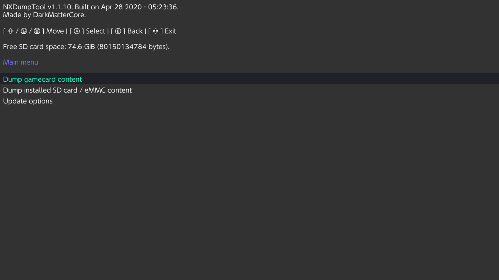
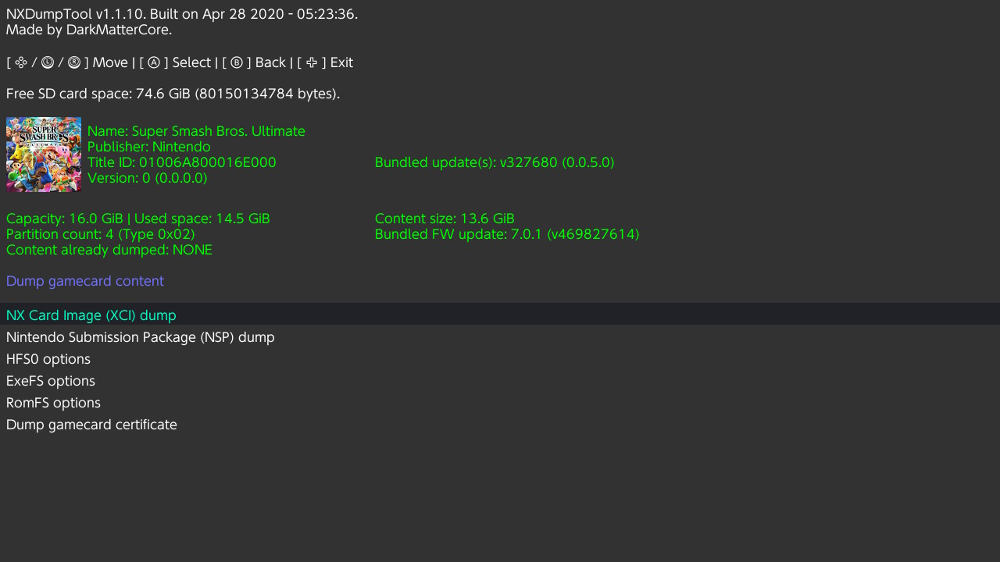
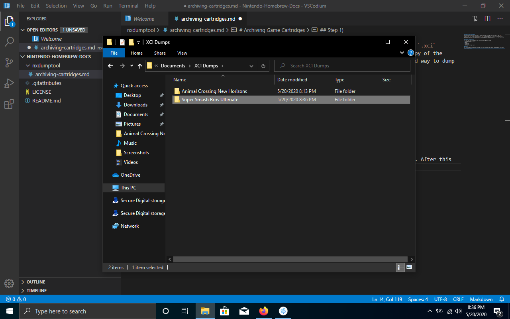
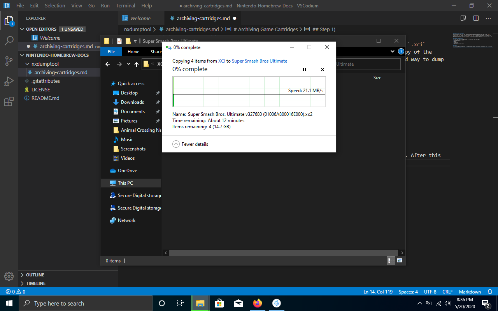
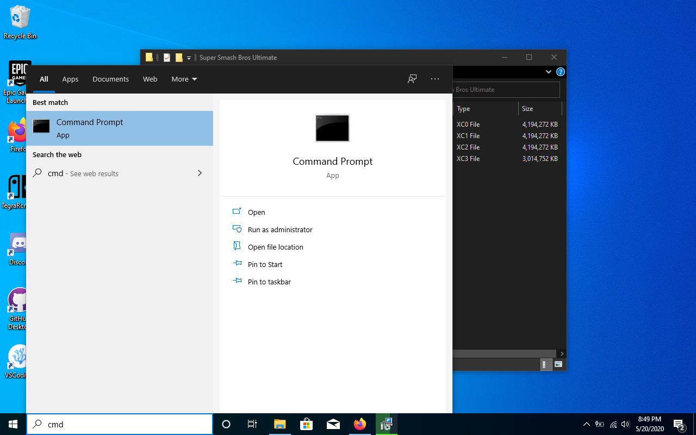
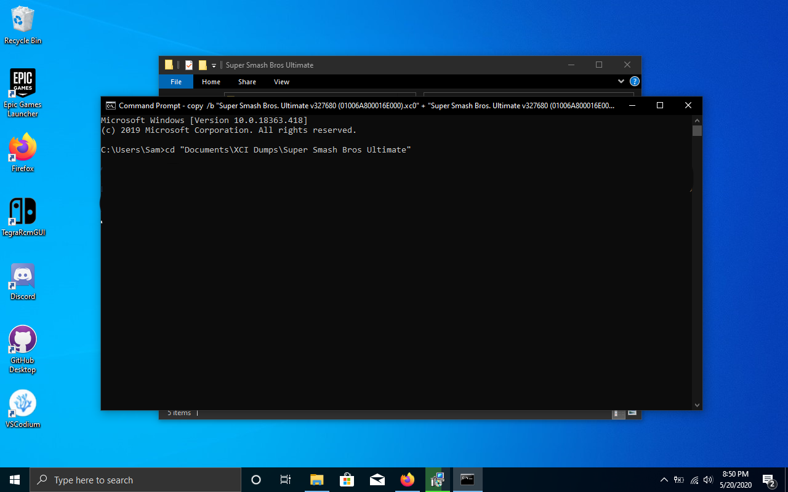
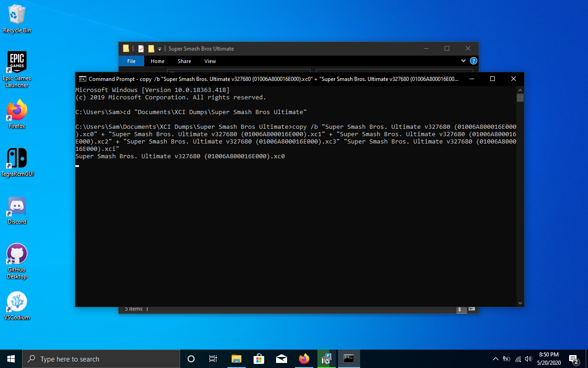
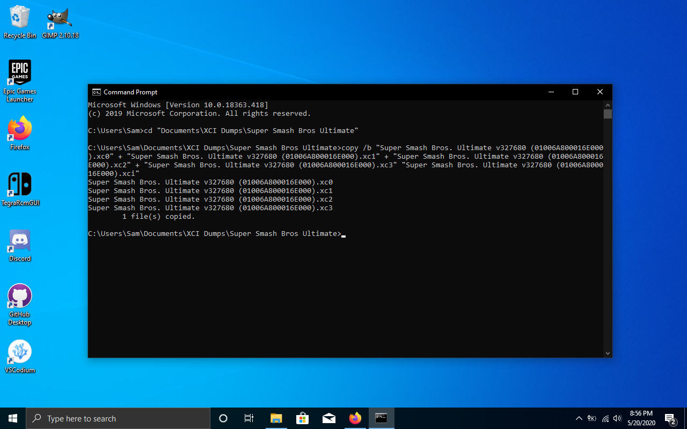

# Archiving Game Cartridges
In this tutorial, you will know how to backup your game cartridges and save them in the `.xci` format. This `.xci` format is similar to a `.iso` file on computers, as they are 1:1 copy of the game cartridge, just like how a `.iso` is a 1:1 copy of a CD/DVD/Blu-Ray. This is a good way to dump your games for if you like to archive all of your physical media like I do.

## Step 0) Prerequisites
You will need the following in order to archive your game cartridge:
- A hackable Nintendo Switch
- Atmosphere CFW
- Hekate
- Sigpatches
- NXDumpTool
- The game cartridge (duh!)

## Step 1)
The first step in this proccess is to go into your emummc and open up the Homebrew Menu. After this launch NXDumpTool.

## Step 2)
Once you are in NXDumpTool, press `A` on `Dump gamecard content`.


## Step 3)
Next, press `A` on `NX Card Image (XCI) dump`.


## Step 4)
You will now be taken to a settings menu on what to set for your XCI dump. You should have your settings set as the image below, but if you can't view the image here's it in text form:
```
Split output dump (FAT32 Support): Yes
Create directory with archive bit set: No
Keep certificate: No
Trim output dump: No
CRC32 checksum calculation + dump verification: Yes
Dump verification method: NSWBD.COM XML database (offline)
Output naming scheme: TitleName v[TitleVersion] ([TitleID])
```


Once you have the settings set to the ones provided, click `Start XCI dump proccess`!

## Step 5)
Once you have started the dump proccess you will have to wait, as it takes anywhere between 5-15 minutes depending on how big the game is. When the dump has finished you will get an output similar to the picture below, the red error is fine as all it's saying is that it couldn't find a database file.


## Step 6)
Turn off your switch and insert the sd card into your computer. Naviagte to your sd card and open the folder `switch`, then go into the folder `nxdumptool` and then `XCI`. You should see multiple `.xc#` (where `#` is a number). If your game was smaller than 4gb then there will be only a `.xci` file. Copy all of the files somewhere onto your computer.

In this demonstration, I will be making a directory called `Super Smash Bros. Ultimate` for the game of the same name. This game has multiple `.xc#` files.



### Note!
If you only have the one `.xci` file, congrats! You have successfully made a 1:1 replica of your game cartridge ready for archiving! If you have multiple `.xc#` files, you will have to keep going through the steps (most games are over 4gb).

## Step 7)
After the `.xc#` files have been done copying, open up the command prompt by typing `cmd` in the search bar at the bottom.


## Step 8)
This is a bit complicated, but the next thing you will have to do is enter the directory you have the `.xc#` files. To do this type `cd THE\DIRECTORY\WITH\XCI\` (Your directory will not be "THE\DIRECTORY\WITH\XCI\".

In this example, I am switching to the Super Smash Bros. Ultimate folder made in my Documents folder.


Here is the command to run if you cannot see the image. `cd "Documents\XCI Dumps\Super Smash Bros Ultimate"`

## Step 9
The next command we will run will combine all the `.xc#` files into one `.xci` file. In this example, Super Smash Bros. Ultimate has 4 `.xc#` files. In order to combine them we will run the command below. The image below shows the example of Super Smash Bros. Ultimate.

(Note: the file will obviously not be `Nintendo Switch Game`. Replace it with the name of the file.)
```copy /b "Nintendo Switch Game.xc0" + "Nintendo Switch Game.xc1" "Nintendo Switch Game.xci"```



You will need to wait a while, but after some time you should get something like this image, where it says that 1 file has been copied.


## Step 10
Congrats! You have You have successfully made a 1:1 replica of your game cartridge ready for archiving! I hope this guide helps you with archiving your games ^^
